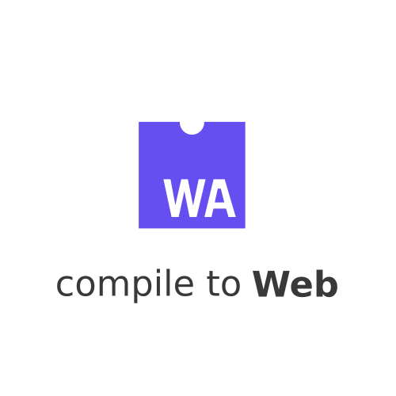

# 

Discover what languages can be compiled into [Web Assembly (WASM)](http://webassembly.org)

## Languages

| Language                  | Compiles to LLVM        | Compiles to WASM        |
|---------------------------|:-----------------------:|:-----------------------:|
| [C](C/)                   | :ballot_box_with_check: | :ballot_box_with_check: |
| [C#](C%23/)               | :ballot_box_with_check: | :ballot_box_with_check: |
| [C++](C++/)               | :ballot_box_with_check: | :ballot_box_with_check: |
| [Crystal](Crystal/)       | :ballot_box_with_check: | :question:              |
| [F#](F%23/)               | :ballot_box_with_check: | :ballot_box_with_check: |
| [Go](Go/)                 | :question:              | :question:              |
| [Haskell](Haskell/)       | :question:              | :question:              |
| [Java](Java/)             | :ballot_box_with_check: | :ballot_box_with_check: |
| [Julia](Julia/)           | :ballot_box_with_check: | :question:              |
| [Kotlin](Kotlin/)         | :ballot_box_with_check: | :ballot_box_with_check: |
| [Nim](Nim/)               | :question:              | :question:              |
| [Python](Python/)         | :question:              | :question:              |
| [Rust](Rust/)             | :ballot_box_with_check: | :ballot_box_with_check: |
| [Scala](Scala/)           | :ballot_box_with_check: | :no_entry:              |
| [Swift](Swift/)           | :ballot_box_with_check: | :no_entry:              |
| [TypeScript](TypeScript/) | :question:              | :question:              |

### Key

| Icon                    | Meaning |
|:-----------------------:|---------|
| :ballot_box_with_check: | Success |
| :no_entry:              | Broken  |
| :question:              | Unknown |

## Installation

1.  Install [Vagrant](https://www.vagrantup.com/downloads.html)
2.  Install [VirtualBox](https://www.virtualbox.org/wiki/Downloads)
3.  For a desired language `cd` into the folder, then run
``` sh
vagrant up
vagrant ssh
sudo su -
install
build
```

## Contributing

Interested in seeing a new language? Found a bug in the examples?
Check out the [Contributing Guide](CONTRIBUTING.md) for how to get involved!

## FAQ

**Question**: Why is "Compile to LLVM" listed?

**Answer**: [LLVM](https://llvm.org/) was an [influence for WebAssembly technology](http://webassembly.org/docs/faq/#why-not-just-use-llvm-bitcode-as-a-binary-format) and [was the first compiler infastructure with official WASM support](http://webassembly.org/docs/faq#which-compilers-can-i-use-to-build-webassembly-programs).
